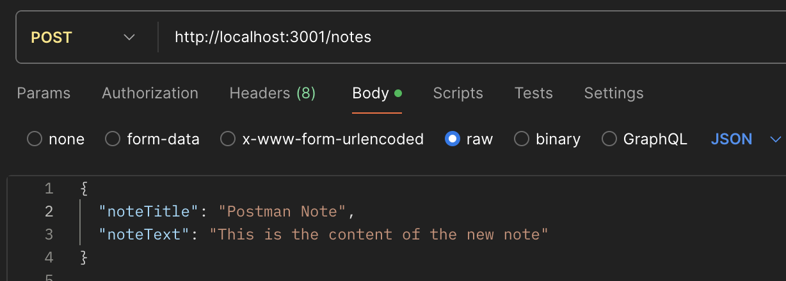
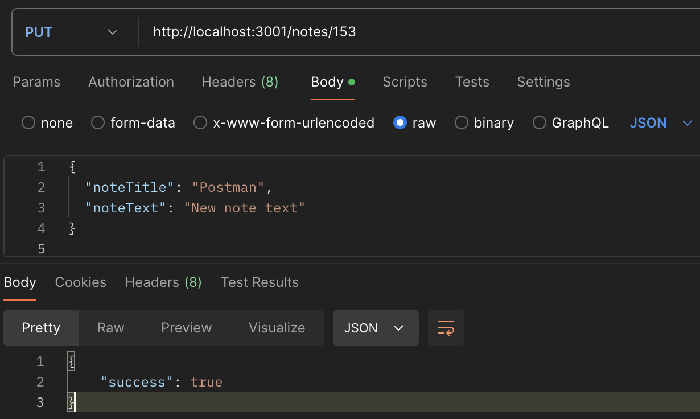
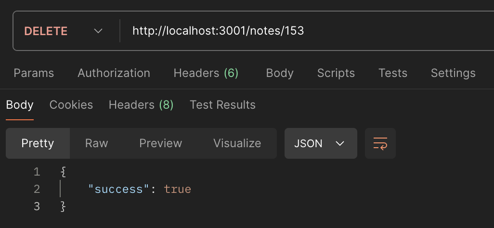
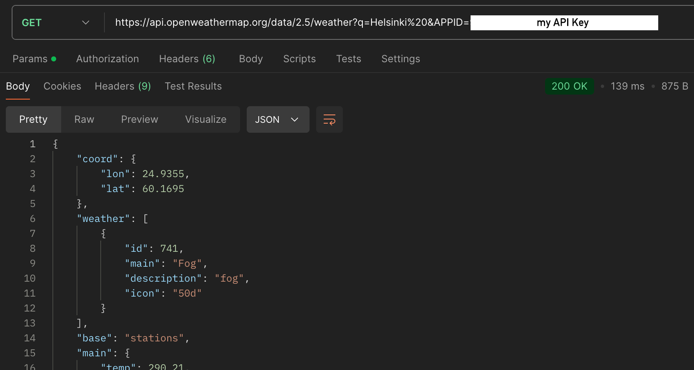
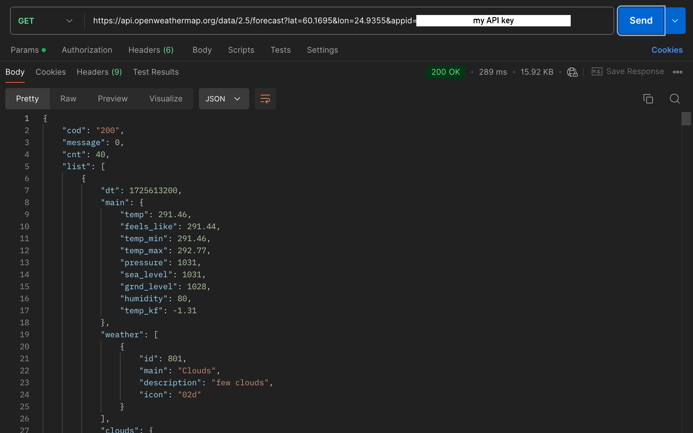

# Postman

## About

- In this repository I will document different personal use cases for Postman
- Postman is software which allows us to test API end points. When targeting an end point we can try different HTTP methods like GET, PUT, POST and more. We can't do anything which isnt defined my the API. For example, if an API hasn't defined a function for adding new items, then we can't insert new there items with Postman.

 

## Local development environment

I made a browser based application named [React-Full-Stack-Project](https://github.com/KrisHHFI/React-Full-Stack-Project).
The project's back end uses Express.js and Node.js. 
The front end uses React. 
The project enables the user to create, edit and delete notes.
These notes are saved to a SQLite table.

GET Method

 
 Tested the root URL.

 ---
 
 
 Used the GET method to the "/notes" endpoint, which returned all the notes.
 

POST Method

 
 
 Used the POST method to the "/notes" endpoint. In the body I defined a new note. This added a new note to the table.
 

PUT Method

  
 
 Used the PUT method to the "/notes" endpoint. I defined the note ID in the URL, in this case it was 153. In the body I defined the updated note. This updated the note in the table.
 

DELETE Method

  
 
 Used the DELETE method to the "/notes" endpoint. I defined the note ID in the URL, again I used 153. This deleted the note from the table.

 

## Online API service (OpenWeatherMap API)

I previously used the OpenWeatherMap API in my [React Weather App](https://github.com/KrisHHFI/React-Weather-App). This app used a GUI to interact with the API. However, Postman can also be used to return the same data. So, I made the same calls I did in my weather app in Postman.

GET Method

 
 Today's weather in Helsinki.

 ---

 
 The forecasted weather in Helsinki.

