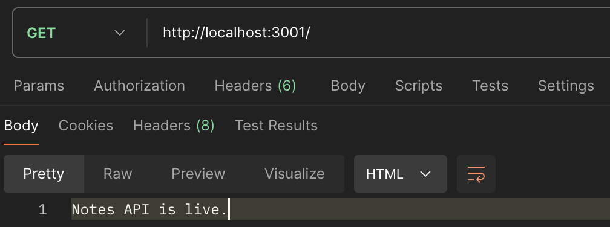
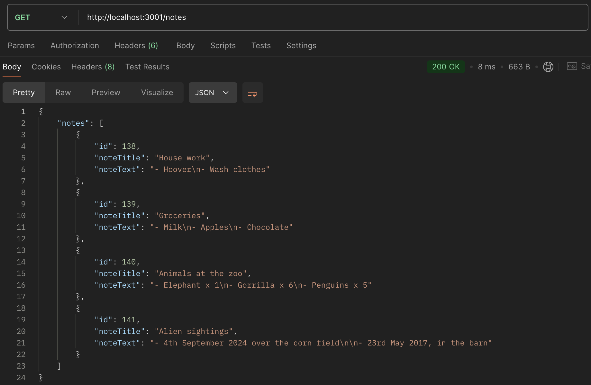

# Postman

## About

In this repository I will document different personal use cases for Postman

### Local development environment

I made a browser based application named [React-Full-Stack-Project](https://github.com/KrisHHFI/React-Full-Stack-Project).
 The project's back end uses Express.js and Node.js. 
 The front end uses React. 
 The project enables the user to create, edit and delete notes.
 These notes are saved to a SQLite table.

Use case:

GET Method

Tested the root URL.

 
 

Tested the "/notes" endpoint, which returned all the notes.

